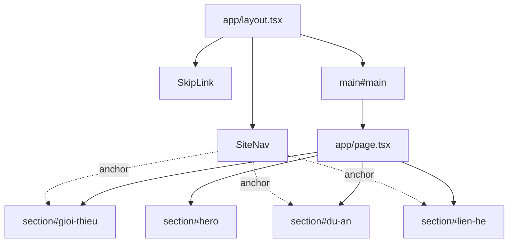

# Phase 02 — Layout + navigation

## Context links
- Design: `/Users/nguyennghia/test-portpolio/.taw/design.json` → `layout.nav`
- Depends on Phase 01 scaffold

## Overview
Build the sticky floating glass nav (`Giới thiệu / Dự án / Liên hệ`) and the root page shell. Smooth-scroll anchors to `#gioi-thieu`, `#du-an`, `#lien-he`. Skip-link for a11y.

## Key insights
- Nav is a Client Component (`"use client"`) only if we need active-section highlighting — otherwise keep Server. Start Server, add client highlighter later only if polish budget allows.
- Floating style: `fixed top-4 inset-x-4 md:inset-x-auto md:left-1/2 md:-translate-x-1/2`, backdrop-blur, `bg-black/60`, `border border-white/10`.
- Main sections each get `scroll-mt-24` so anchor offset accounts for nav.

## Requirements
- Keyboard nav: Tab reaches skip-link first, then logo, then 3 nav links
- Mobile: nav collapses to compact pill (no hamburger — only 3 links, they fit)
- Respect `prefers-reduced-motion` for scroll behavior (via `html { scroll-behavior: smooth }` wrapped in `@media (prefers-reduced-motion: no-preference)`)

## Related code files
**create**
- `components/site-nav.tsx`
- `components/skip-link.tsx`

**modify**
- `app/layout.tsx` — mount `<SkipLink />` + `<SiteNav />` above `{children}`
- `app/page.tsx` — add 4 empty `<section id="...">` placeholders with `scroll-mt-24`
- `app/globals.css` — add reduced-motion aware `scroll-behavior`

## Implementation steps
1. Create `components/skip-link.tsx` — anchor to `#main`, visually hidden until focus.
2. Create `components/site-nav.tsx` — ul of 3 anchor links, logo "TH" on left.
3. Update `app/layout.tsx` — render skip-link + nav, wrap children in `<main id="main">`.
4. Update `app/page.tsx` — 4 empty sections with ids `hero`, `gioi-thieu`, `du-an`, `lien-he`, each with `scroll-mt-24 py-24 md:py-32`.
5. Add smooth-scroll rule to `globals.css`.
6. Verify keyboard traversal and `npm run build`.

## Architecture

## Todo
- [ ] SkipLink component created, tabbable
- [ ] SiteNav component renders 3 Vietnamese links
- [ ] Nav is floating glass on desktop, full-width pill on mobile
- [ ] layout.tsx mounts both + wraps children in `<main id="main">`
- [ ] page.tsx has 4 id'd sections
- [ ] Anchor click scrolls to correct section with offset
- [ ] `npm run build` passes

## Success criteria
- Tabbing from top reveals skip-link visibly
- Clicking `Dự án` scrolls to `#du-an` with ≥24px top offset
- Nav stays pinned on scroll, blurs backdrop
- No TS errors, no a11y warnings from eslint-plugin-jsx-a11y
