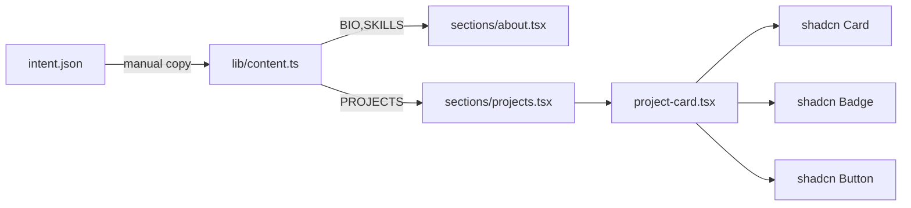

# Phase 04 — About + Projects

## Context links
- Intent → `clarifications.bio`, `reference_design.sample_projects`
- Design → `layout.about`, `layout.projects`

## Overview
Two sections in one phase because they share a data-rendering pattern (content from intent.json → typed TS constants → JSX). About is a simple prose block plus a skills chip row. Projects is a 2×2 card grid.

## Key insights
- Hoist project + skill data to `lib/content.ts` so future edits are single-file
- Each project card: title, short desc, stack `Badge` list, single link button (`Xem demo` or `Xem source` depending on `link_type`)
- Since real GitHub/demo URLs are placeholders (`#`), render buttons as disabled-looking ghost links to `#` — but still tabbable and not visually broken
- Stack chips use shadcn `Badge` with `variant="secondary"` and a consistent monospace tone

## Requirements
- Projects data typed via `type Project = { name; desc; stack: string[]; linkType: 'demo' | 'source' }`
- Cards: hover lifts (`hover:-translate-y-0.5 hover:border-zinc-600 transition`)
- Grid: `grid-cols-1 md:grid-cols-2 gap-5`
- About uses `<article>` semantics; heading `Giới thiệu`

## Related code files
**create**
- `lib/content.ts` — `BIO`, `SKILLS`, `PROJECTS`
- `components/sections/about.tsx`
- `components/sections/projects.tsx`
- `components/project-card.tsx`

**modify**
- `app/page.tsx` — mount `<About />` inside `#gioi-thieu`, `<Projects />` inside `#du-an`

## Implementation steps
1. Write `lib/content.ts` exporting typed constants.
   - `BIO` = intent bio string
   - `SKILLS` = `['React', 'Next.js', 'Node.js', 'TypeScript', 'PostgreSQL', 'Tailwind CSS']`
   - `PROJECTS` = 4 entries from intent `sample_projects`, with `linkType` field
2. Build `components/sections/about.tsx`:
   - `<h2 id="gioi-thieu-title">Giới thiệu</h2>`
   - Two-column grid md+: left column bio paragraph (`text-zinc-300 leading-relaxed max-w-prose`), right column skills as badge row.
3. Build `components/project-card.tsx` using shadcn `Card`:
   - `CardHeader` → title + description
   - `CardContent` → Badge list for stack
   - `CardFooter` → Button link: `Xem demo` if `linkType==='demo'`, else `Xem source`, icon `ArrowUpRight` from lucide
4. Build `components/sections/projects.tsx`:
   - Heading `Dự án`
   - Small muted sub-line: `Một vài sản phẩm gần đây tôi đã làm.`
   - Grid maps `PROJECTS` to `<ProjectCard />`
5. Mount in `app/page.tsx`.
6. `npm run build`.

## Architecture

## Todo
- [ ] `lib/content.ts` holds BIO + SKILLS + PROJECTS with correct VN text
- [ ] About section renders bio + skills, two-column on md+
- [ ] ProjectCard component handles demo vs source button label
- [ ] Projects grid is 2x2 on desktop, 1 column on mobile
- [ ] Hover lift works, no layout shift
- [ ] All card buttons are keyboard-focusable
- [ ] `npm run build` passes

## Success criteria
- 4 project cards render with exact Vietnamese names/descriptions from intent.json
- Skills badges wrap cleanly, no overflow
- Cards have visible border + hover state in dark mode
- Tab order: section heading skipped (no tabindex), lands first on first card button
